# ላቁም? (Laqum)

**Real-time parking for Addis Ababa.**

Finding parking in central Addis Ababa means circling and asking. Laqum lets
a driver see nearby lots and how many slots are free, hold one with a small
deposit, drive there, and check in and out with a QR code. At the lot, the
attendant sees every slot on a tablet, updated live as cars arrive, overstay
and leave, and handles walk-ins and cash payments.

Two apps and one API: an **Expo (React Native) driver app**, a **React web
dashboard** for attendants, and a **Node.js API**, in Amharic and English.

> **Status: not launched.** Built through five phases and device-tested on an
> Android phone. [What launch still needs](#status) is listed below.

## Screenshots

**Attendant dashboard.** From the end-to-end suite, which renders every
screen in both themes and both languages
([all of them](e2e/screenshots/)).

| Light: every slot state                                                                 | Dark, in Amharic                                                                   |
| --------------------------------------------------------------------------------------- | ---------------------------------------------------------------------------------- |
| 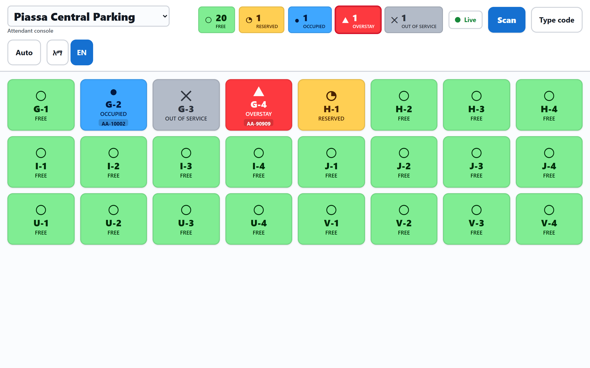 | 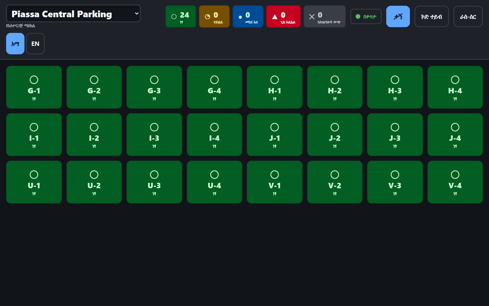  |
| **Dark: every slot state**                                                              | **A slot's details and actions**                                                   |
| 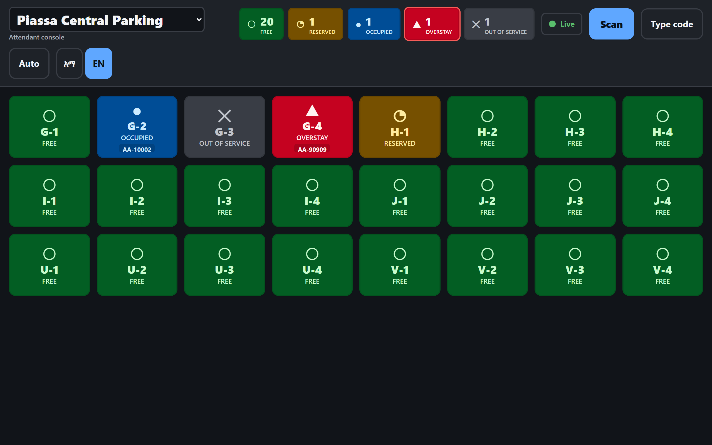   | 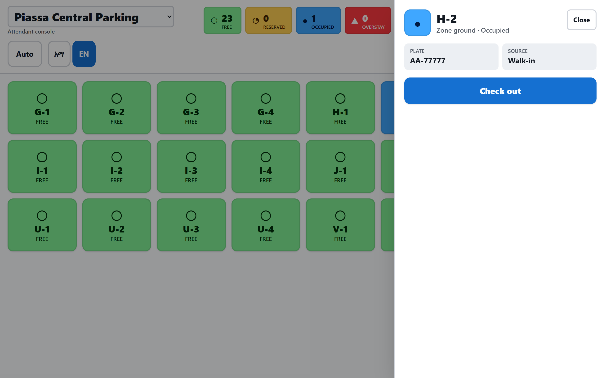 |

Each status has a colour, a geometric glyph and a word, so it never depends on
colour alone.

**Brand.** The app icon under each Android launcher mask, and the opening
animation. The animation strip is composited from the app's own images and
timing, not captured on a phone.

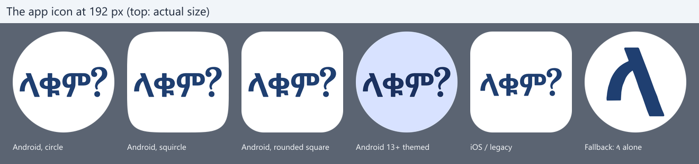

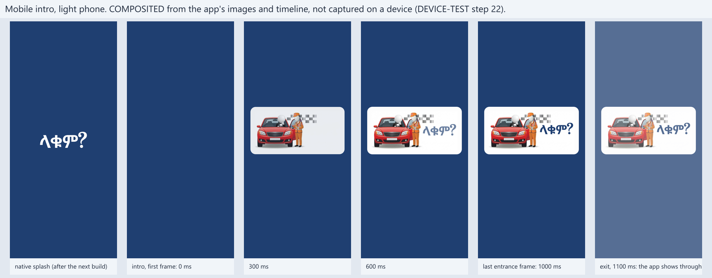

**Driver app.**

These device screenshots show the driver flow from navigation and nearby-lot
discovery through booking and the active booking QR code.

| Navigation hand-off                                                          | Nearby lots                                                                |
| ---------------------------------------------------------------------------- | -------------------------------------------------------------------------- |
| 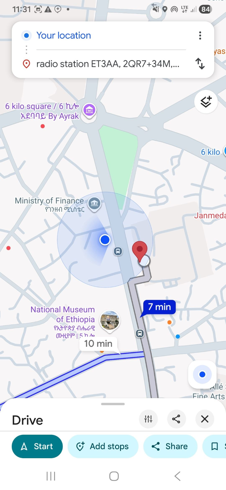 | 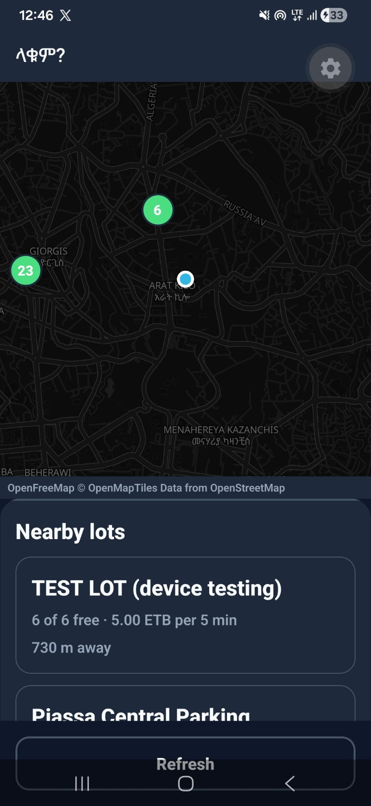 |

| Book a slot                                                   | Active booking and gate QR code                                          |
| ------------------------------------------------------------- | ------------------------------------------------------------------------ |
| 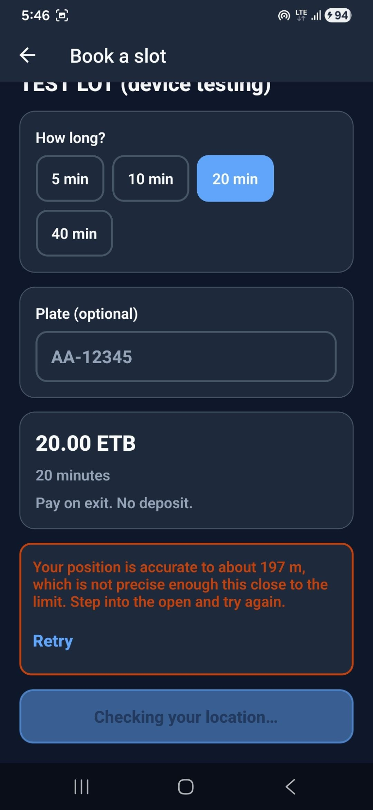 | 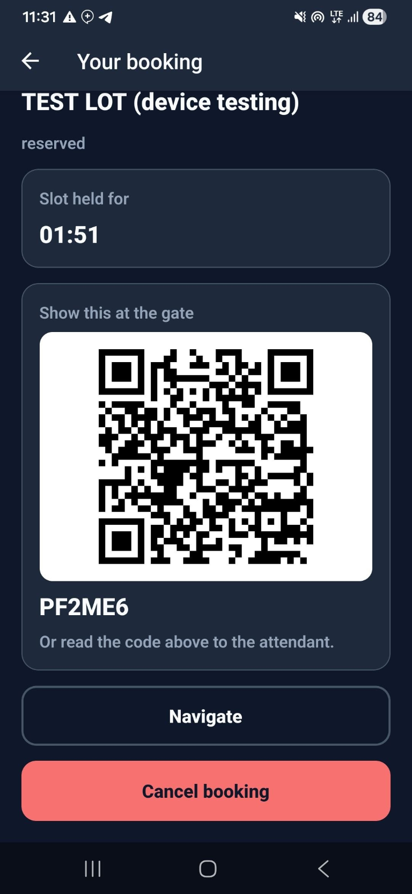 |

## Features

**Driver app** (`apps/mobile`)

- Nearby lots on a map and in a list, with their free-slot counts.
- Booking with a location check that weighs the distance against the fix's
  accuracy, and an optional deposit paid through **Chapa**, an Ethiopian
  payment gateway.
- A hold countdown kept on server time, not the phone's clock, and a QR code
  plus a short code for the gate.
- Navigate: hands off to Google Maps, with fallbacks when it isn't installed.
- Extend, check out, and pay the balance in the app or in cash to the
  attendant.
- Booking changes arrive live over a socket. Push notifications: 5 minutes
  before a hold is released, when it is, before parking time ends, on
  overstay, and when payment is due.
- Amharic and English (follows the phone, switchable), dark mode, sign out.

**Attendant dashboard** (`apps/dashboard`)

- Each lot as a grid of slots, with counters and a connection indicator that
  says when the screen has stopped updating.
- Check-in by camera QR scan or typed short code, walk-ins, check-out, cash,
  and taking a slot out of service.
- A change made on one screen reaches the others within a second (the
  end-to-end budget on one machine).
- Staff sign in with a one-time code. Amharic and English, light and dark.

**Admin API**: lots and their slot grids, adding and removing attendants,
and a refund queue for money the operator owes back.

## Tech stack

| Area      | Choice                                                                                       |
| --------- | -------------------------------------------------------------------------------------------- |
| API       | Node.js 24, Express 5, Socket.io 4 (Redis adapter), BullMQ, Kysely on PostgreSQL 16, Redis 7 |
| Dashboard | React 19, Vite 8, Tailwind 4, i18next                                                        |
| Mobile    | Expo SDK 57 (React Native 0.86), expo-router, MapLibre with OpenFreeMap tiles                |
| Shared    | TypeScript (strict) everywhere; zod schemas shared by all three apps                         |
| Services  | Chapa (payments), Expo push with Firebase Cloud Messaging, EAS Build                         |
| Delivery  | Docker Compose, Caddy (automatic HTTPS), GitHub Actions                                      |
| Testing   | Vitest and supertest against a real PostgreSQL and Redis; Playwright                         |

A standing constraint shaped several choices: **no international payment
card** was available. Google Maps, which needs a card-backed billing account,
was replaced by MapLibre over OpenFreeMap, and every service used is one that
can be paid in birr or is free without a card.

## Architecture

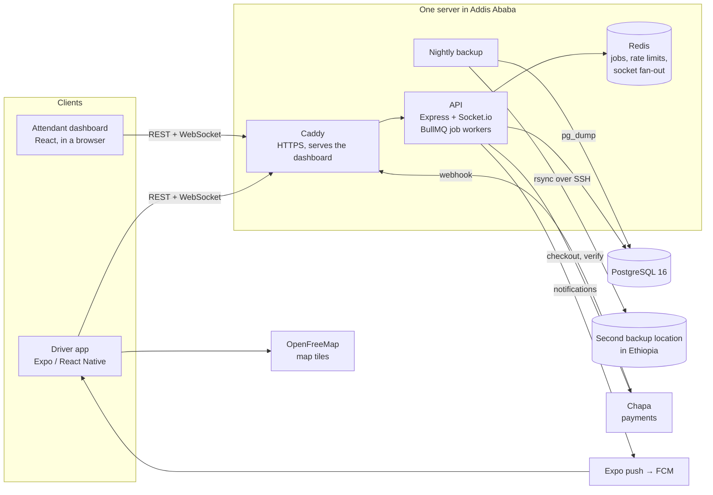

The workspace is five pnpm packages: `apps/api`, `apps/dashboard`,
`apps/mobile`, `packages/shared` (types, zod schemas, the booking state
machine, billing, the realtime store) and `db` (migrations, seed, generated
types).

## Engineering highlights

Each claim links to the code or test that shows it.

- **No double booking, enforced by the database.** A partial unique index
  (`one_live_booking_per_slot`) allows one live booking per slot. Creating a
  booking is a plain `INSERT`, never check-then-insert, and every status
  change goes through one compare-and-set function. Tested with concurrent
  requests: [`concurrency.test.ts`](apps/api/test/concurrency.test.ts),
  [`transition-concurrent.test.ts`](apps/api/test/transition-concurrent.test.ts),
  and [`schema.test.ts`](db/test/schema.test.ts), which reads the index
  predicates back from PostgreSQL.
- **Realtime that survives reordering and reconnect storms.** Every change
  carries a per-lot version assigned in commit order, and clients drop
  anything older than their snapshot
  ([`realtimeStore.test.ts`](packages/shared/src/realtimeStore.test.ts)).
  Many phones in Ethiopia share one carrier address, so connection limits
  apply per user, with only a loose flood guard per address. A test
  reconnects 200 users from one address after a cut and none are refused
  ([`socket-limits.test.ts`](apps/api/test/socket-limits.test.ts)). A socket
  dies with its token, and removing an attendant cuts their open dashboard
  off at once ([`realtime-auth.test.ts`](apps/api/test/realtime-auth.test.ts)).
- **Notifications that are still true when they arrive.** Every notification
  job re-reads the booking and sends nothing if the news is stale: checked in
  before the warning, extended, nothing left to pay
  ([`notify.ts`](apps/api/src/push/notify.ts),
  [`push.test.ts`](apps/api/test/push.test.ts)).
- **Ethiopian time and polite Amharic.** Amharic screens show the Ethiopian
  12-hour clock (14:05 reads **ከሰዓት 8:05**), tested at every boundary
  ([`clockDisplay.test.ts`](packages/shared/src/clockDisplay.test.ts)).
  Every Amharic string uses the polite, gender-neutral form, checked by a
  test over every bundle ([`register.ts`](packages/shared/src/register.ts)).
  Both languages must have the same keys, so an English string can't ship
  untranslated.
- **Data kept in Ethiopia.** Ethiopia's Personal Data Protection
  Proclamation No. 1321/2024 (Art. 22(1)) requires personal data collected
  locally to be stored in Ethiopia, so the hosting and both backup locations
  are in the country. What leaves it is kept minimal: a push notification
  carries no phone number, name or plate, which is tested
  ([`docs/DEPLOY.md`](docs/DEPLOY.md#14-data-protection)).
- **Backups that are proved by restoring them.** A nightly `pg_dump` is
  copied off the server over SSH with a pinned host key
  ([`backup.sh`](deploy/backup.sh)). [`restore-check.sh`](deploy/restore-check.sh)
  restores a dump into a throwaway PostgreSQL and checks the migrations, the
  rows and the double-booking index. CI's production-stack job
  ([`smoke.sh`](deploy/smoke.sh)) builds the production images, backs up,
  restores and checks on every push.
- **Tested against real infrastructure.** Integration tests run against a
  real PostgreSQL and Redis, never mocks. At the last full run: **965 unit and
  integration tests** (1 more is Linux-only and runs in CI) and **23
  end-to-end browser tests** against the compiled API and built dashboard.

## Status

**Not launched.** The code is complete through Phase 5, and the driver app
passed a device test on an Android phone, including a real push notification
([results](docs/DEVICE-TEST.md)). iOS has never been built.

Launch still needs:

- an **SMS provider**: sign-in codes are only written to the server log today;
- the **Chapa sandbox check** of how it reports fees, before real money;
- review of **47 Amharic strings** added since the last native-speaker review;
- the remaining **device-test steps**, including confirming the push-token
  fix on a fresh install;
- a **one-hour trial** on the chosen host (AletCloud, Addis Ababa) to measure
  latency from Ethio telecom mobile data;
- **registration** with the Ethiopian Communications Authority, and
  confirmation of the brand illustration's licence.

## Development

Setup, tests, the device test and deployment:

- [docs/DEVELOPMENT.md](docs/DEVELOPMENT.md): running it locally, the test
  suites, and the repository layout;
- [docs/DEPLOY.md](docs/DEPLOY.md): deploying to a server in Ethiopia;
- [docs/DEVICE-TEST.md](docs/DEVICE-TEST.md): the phone test, step by step;
- [CLAUDE.md](CLAUDE.md): the engineering charter, with the architecture,
  the fixed booking state machine, the invariants, and the reasons behind
  each decision.
